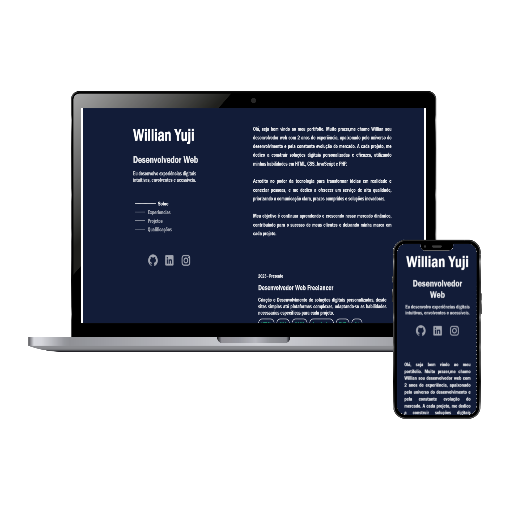

<h1 align="center">Portfolio</h1>

  

<h4 align="center">🚀 Finalizado 🚀</h4>

### 🛠 Tecnologias

As seguintes ferramentas foram usadas na construção do projeto:

- [HTML]
- [CSS]
- [SCSS]
- [JavaScript]

  ##

<a href="https://github.com/Willian017">
 
  
</a>

Feito com ❤️ por Willian Yuji 👋🏽 Entre em contato!

 

